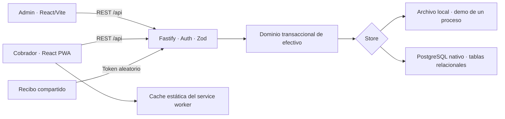

# Arquitectura del scaffold

Dos aplicaciones web independientes, un backend y un dominio común del lado servidor. No se implementa aplicación móvil nativa. No se utiliza Docker para ejecutar, probar ni desplegar este scaffold, de acuerdo con la corrección del usuario.

## Decisiones implementadas

- npm workspaces y lockfile único; TypeScript estricto; React 19, Vite 7, Tailwind 4, Lucide y Radix Dialog. Toasts con Sonner y movimiento CSS respetando reduced-motion.
- Backend Fastify 5 y esquemas Zod que generan entradas OpenAPI 3.1. Un API compartido evita duplicar reglas entre administración y cobradores.
- Dinero entero en centavos, ledger inmutable, roles comprobados en el servidor, idempotencia y operaciones serializadas. La UI nunca autoriza un saldo por sí sola.
- Demo opt-in con datos ficticios, secretos locales fuera de Git y JWT ligados a la configuración activa. PostgreSQL obligatorio fuera de demo.
- Seguimiento GPS explícito y mapa Leaflet; publicación de posición por HTTP. No hay un servicio oculto de rastreo ni acceso nativo al dispositivo.
- Comprobantes con acceso mediante token aleatorio, impresión del navegador y salida binaria ESC/POS para un puente externo.
- La nueva base se define en `DATA_MODEL.md`; no hay mapping definitivo del legado porque no se pudo restaurar ni autenticar sus módulos.

## Límites que requieren evolución antes de producción

La capa PostgreSQL carga el agregado completo y serializa escrituras globalmente. Esto prioriza invariantes y permite sustituir repositorios más adelante, pero no equivale a un diseño escalado. Separar consultas paginadas, escribir solo agregados del cobrador y definir retención de idempotencia/auditoría.

Completar gestión de identidades, recuperaciones de jornada, asientos compensatorios y aprobación operacional. Pasar de campos de tiempo ISO text del scaffold a tipos nativos donde convenga, conservando fechas locales de negocio. Añadir respaldos, observabilidad operacional, migraciones versionadas incrementales y pruebas de dispositivo/impresora sobre el despliegue elegido.

La ejecución local usa `127.0.0.1` para evitar una colisión observada con otra aplicación ajena que escucha en `::1:5173`. No se cambió ni detuvo esa aplicación. Los dominios productivos, HTTPS y proxy `/api` deben configurarse expresamente; no están desplegados en esta entrega.
