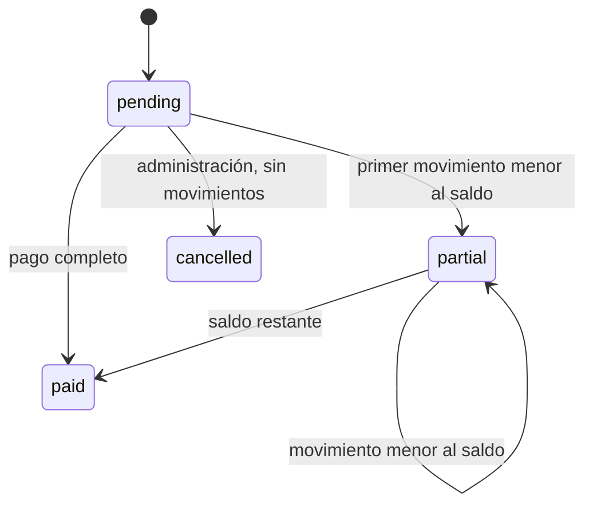

# Reglas operativas y matemáticas

CyP administra efectivo, cargos por servicios y pagos autorizados a clientes. No calcula impuestos, préstamos, intereses ni amortizaciones. La interpretación objetivo de **Descargo** es una autorización de salida de efectivo; su correspondencia exacta con el sistema legado sigue pendiente de acceso autenticado o extracción SQL.

## Dinero, fechas y ecuación

La API representa RD$ 123.45 como `12345` centavos enteros. Los movimientos aceptan cantidades positivas entre 1 y 1,000,000,000 centavos. PostgreSQL almacena `bigint`; el dominio opera con enteros JavaScript dentro de este rango. El calendario operativo usa `America/Santo_Domingo`; a las 03:59:59 UTC todavía es el día anterior. El backend asigna el instante del movimiento.

Para cobrador `c` y fecha `d`, sumando exclusivamente movimientos contabilizados:

```
Cobrado              = Σ collection.amount
Depositado           = Σ deposit.amount
EntregadoPorOficina   = Σ office_delivery.amount
PagadoAClientes       = Σ payout.amount
Diferencia           = (Cobrado - Depositado)
                     + (EntregadoPorOficina - PagadoAClientes)
```

`POST /api/cuadres` calcula todo en el servidor. Nunca acepta totales declarados por el navegador. Solo administración puede cerrar, y únicamente si **Diferencia = 0 exacto**, sin tolerancia de redondeo. Un depósito es confirmación administrativa de efectivo recibido; no es una integración bancaria.

## Dos fondos y límites

`FondoCobros = Σ Cobrado - Σ Depositado` y `FondoPagos = Σ EntregadoPorOficina - Σ PagadoAClientes`, acumulados en el libro del cobrador. Ambos deben permanecer no negativos. El efectivo total mostrado es la suma. Los fondos se mantienen separados: un cobro no financia automáticamente un pago.

| Operación          | Condición previa                                               | Efecto                                                       |
| ------------------ | -------------------------------------------------------------- | ------------------------------------------------------------ |
| Cobro              | importe ≤ saldo del cargo; FondoCobros + importe ≤ LimiteCobro | incrementa FondoCobros y cobrado del cargo                   |
| Depósito           | administración; importe ≤ FondoCobros                          | reduce FondoCobros                                           |
| Entrega de oficina | administración; FondoPagos + importe ≤ LimitePago              | incrementa FondoPagos                                        |
| Pago               | importe ≤ saldo del descargo y ≤ FondoPagos                    | reduce FondoPagos e incrementa pagado del descargo           |
| Cierre             | administración; diferencia diaria = 0                          | crea cierre único, bloquea nuevos movimientos de esa jornada |

`LimiteCobro` limita efectivo cobrado todavía no depositado; `LimitePago` limita anticipos de oficina todavía no entregados. Esta es una decisión explícita del diseño nuevo, pendiente de validar contra semántica del legado. Alcanzar exactamente el límite se permite, excederlo se rechaza. Estados “Límite alcanzado” del mapa no equivalen a una autorización para excederlo.

## Estados



Una autorización con movimientos no puede cancelarse. Los movimientos financieros son inmutables; revocar un enlace de recibo no revierte el cobro. El scaffold no ofrece anulaciones contables ni devoluciones de anticipos. Se deben diseñar como asientos compensatorios con autorización antes de permitirlos en producción. “Obligado a cobrar” es prioridad visible, nunca una instrucción para forzar un cobro sin efectivo recibido.

## Consistencia e idempotencia

Toda creación de cargo, lote recurrente, descargo, cobro, pago, depósito, entrega, cancelación y cierre requiere `Idempotency-Key`. La clave se delimita por usuario, con huella de ruta y payload validado. Una repetición idéntica devuelve la respuesta original; una clave reutilizada con contenido distinto devuelve 409. El lote se confirma completo o se revierte completo.

El adaptador de archivo serializa transacciones en un único proceso y reemplaza atómicamente el archivo. No se debe ejecutar en múltiples procesos. PostgreSQL serializa escrituras con `pg_advisory_xact_lock` y transacción; las lecturas usan `REPEATABLE READ`. La implementación carga el estado operacional completo: adecuada para scaffold y pequeños pilotos, pendiente de repositorios paginados y bloqueos por cobrador para gran escala. Las restricciones y el trigger protegen integridad adicional; no se permiten escrituras externas directas al libro.

## Autorización y cierre de jornada

Administración crea autorizaciones, confirma transferencias y cierra. El cobrador puede consultar solo clientes/rutas/cargos/descargos propios, cobrar/pagar dentro de su ruta y publicar su ubicación voluntariamente. Cada movimiento conserva `actorId`.

No se puede cerrar una fecha futura ni duplicar cierre. La aplicación bloquea nuevos movimientos cuando la fecha ya está cerrada o cuando hay saldo anterior pendiente. El scaffold no automatiza arrastre ni corrección de jornadas antiguas: el procedimiento de recuperación requiere ampliación antes de operar jornadas reales continuas. Esa limitación se mantiene explícita para no ocultar efectivo pendiente con un cambio de fecha.

## Recibos y desconexión

Los enlaces llevan 192 bits aleatorios, muestran solo nombre/concepto/importe/cobrador/fecha y pueden revocarse. Quien tenga el enlace puede leer el recibo. No se incluye dirección ni teléfono; las respuestas llevan `Cache-Control: no-store`. No son comprobantes fiscales. La descarga ESC/POS requiere puente de impresión o controlador local; la impresión del navegador usa su diálogo. Debe probarse cada modelo físico.

La PWA conserva recursos estáticos, nunca respuestas de API, tokens ni recibos en Cache Storage. Desconectada, la UI no confirma operaciones ni acumula cobros para sincronizar más tarde. Una desconexión posterior a enviar una operación exige reintentar con la misma clave para resolver el resultado sin duplicación.
