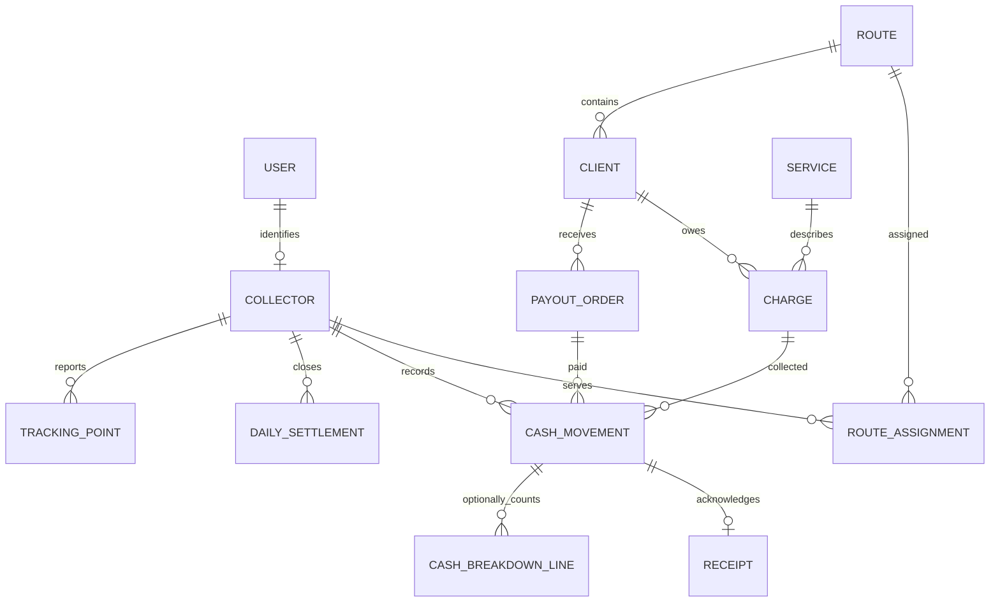

# Data model

The replacement is an operational cash collection and payout system with one API and two web portals. **This is a newly designed model, not a reverse-engineered backup schema.** The actual backup could not be restored without a native SQL engine; see [extraction status](../legacy/database/EXTRACTION_STATUS.md). The legacy meaning of Descargos remains unverified, so the scaffold explicitly interprets it as a customer payout obligation.

## Implemented scaffold and persistence

The current executable PostgreSQL reference migration is [001_initial.sql](../app/server/database/001_initial.sql). Both portals use the same API contract and integer centavo amounts. Synthetic demo IDs are readable strings (`cli-1`, `col-1`, etc.); production IDs should be opaque and generated by the API. Authenticated scope comes from the server identity, never a trusted collector ID supplied by the browser.

| Implemented relation | Key and references                         | Data and invariants                                                                                                                    |
| -------------------- | ------------------------------------------ | -------------------------------------------------------------------------------------------------------------------------------------- |
| `users`              | `id` PK; optional `collector_id`           | Admin/collector identity scaffold, unique email, active/disabled status                                                                |
| `collectors`         | `id` PK; `route_id` → routes               | Name, initials, status, positive `collection_limit` and `payout_limit`, latest location/time                                           |
| `zones`              | `id` PK; unique name                       | Sector grouping used by routes                                                                                                         |
| `routes`             | `id` PK; `zone_id`, `collector_id` FKs     | Current demonstration assignment; route and collector FKs are deferred to allow seed cycle                                             |
| `collection_points`  | `id` PK; `route_id` FK                     | Address and optional coordinates for visit location                                                                                    |
| `clients`            | `id` PK; unique code; route/point FKs      | Display name, phone and assigned collection point; sensitive fields restricted to authorized users                                     |
| `services`           | `id` PK; unique name                       | Normalized service catalog referenced by charges                                                                                       |
| `charges`            | `id` PK; client/service FKs                | Positive amount, collected amount between zero and amount, due date, required flag, lifecycle status                                   |
| `payouts`            | `id` PK; client/collector FKs              | Cash-out obligation, concept, positive amount, paid amount between zero and amount, lifecycle status                                   |
| `collections`        | `id` PK; collector/client/charge/actor FKs | Immutable collected cash ledger row with receipt token and revocation flag                                                             |
| `payments`           | `id` PK; collector/client/payout/actor FKs | Immutable client payout ledger row with receipt token and revocation flag                                                              |
| `cash_handovers`     | `id` PK; collector/actor FKs               | Immutable `deposit` or `office_delivery`, positive amount and timestamp                                                                |
| `daily_settlements`  | `id` PK; unique collector/date             | Stored closure snapshot; generated difference equals `(collected - deposited) + (office_delivered - paid_to_clients)` and must be zero |
| `idempotency`        | Operation key PK                           | Request fingerprint, stored JSON response and creation time; protects retries from duplicate money movements                           |

The reference migration includes client/route, charge/client/due, collection/payment/cash handover date, and payout/collector/status indexes. Triggers reject ledger deletion or financial-field updates while permitting receipt revocation metadata on receipted rows. The backend updates obligation aggregates (`charges.collected`, `payouts.paid`) atomically with their ledger rows.

Current route/collector references are a deliberately small demo representation. The production target below adds assignment history, tracking history, receipt hashing and audit events. Those extensions remain design specifications.

## Normalized production target

| Target relation        | Main columns                                                                                                         | Constraints and purpose                                                                                          |
| ---------------------- | -------------------------------------------------------------------------------------------------------------------- | ---------------------------------------------------------------------------------------------------------------- |
| `users`                | id, email, password_hash or external_subject, role, enabled, created_at                                              | Unique canonical email/subject; role `admin` or `collector`; no plaintext passwords                              |
| `collectors`           | id, user_id, display_name, collection_limit_minor, payout_limit_minor, active                                        | Unique user link; positive limits; no duplicated cash total                                                      |
| `routes`               | id, name, sector, active                                                                                             | Route is independent of staff assignment                                                                         |
| `route_assignments`    | id, route_id, collector_id, valid_from, valid_to                                                                     | Nonoverlapping effective assignment for a route; history retained                                                |
| `clients`              | id, code, display_name, phone, address, route_id, active                                                             | Unique business code; archive instead of deleting referenced clients                                             |
| `services`             | id, name, default_amount_minor, default_required_collection, active                                                  | Operational service catalog; no taxes or interest schedules                                                      |
| `recurrence_rules`     | id, service_id, frequency, start_date, end_date, active                                                              | Explicit generation schedule; future job implementation                                                          |
| `client_services`      | id, client_id, service_id, recurrence_rule_id, amount_minor, required_collection                                     | Client-specific service agreement; effective dates when changes require history                                  |
| `charges`              | id, client_id, service_id, due_date, amount_minor, required_collection, status, recurrence_instance                  | Unique recurrence instance prevents double generation; retain historical amount/required flag snapshots          |
| `payout_orders`        | id, client_id, collector_id, concept, amount_minor, status, created_by                                               | Payable obligation; creation has no physical cash effect                                                         |
| `cash_movements`       | id, collector_id, client_id?, charge_id?, payout_order_id?, kind, amount_minor, occurred_at, business_date, actor_id | Positive money; immutable; correct parent for each kind; no tax/loan columns                                     |
| `receipts`             | id, movement_id, token_hash, issued_at, revoked_at                                                                   | Unique movement and token; revocation removes share access without reversing money                               |
| `cash_breakdown_lines` | movement_id, denomination_minor, quantity                                                                            | Composite PK; positive denomination, nonnegative integral quantity; sum must equal movement amount when supplied |
| `daily_settlements`    | id, collector_id, business_date, ledger_cutoff, four component totals, difference_minor, closed_at, actor_id         | Unique collector/date; difference exactly zero; immutable closure snapshot                                       |
| `tracking_points`      | id, collector_id, latitude, longitude, recorded_at, accuracy_m?                                                      | Valid coordinate ranges; consented tracking and retention policy; separate history from collector identity       |
| `idempotency_records`  | actor_id, operation, key, request_hash, response, created_at                                                         | Unique actor/operation/key; same key with different request returns conflict                                     |
| `audit_events`         | id, actor_id, action, subject_type, subject_id, occurred_at, sanitized_metadata                                      | Append-only business/security events; exclude passwords and full bearer tokens                                   |

Preserving the agreed price on a charge and storing a signed-off settlement snapshot are intentional historical records. Live outstanding amounts are projections from immutable movements. Avoid a second independently editable source of truth for balances. Service catalog and recurrence are normalized domain extensions; the scaffold's batch generation endpoint accepts explicit client IDs and does not claim a background recurrence scheduler.

## Money, time, and risk

- Currency is DOP. One peso equals 100 integer centavos. API values are integers and calculations use integers, with configured bounds inside JavaScript's safe integer range.
- SQL `BIGINT` stores centavos; never use floating point for cash. Percentages, fiscal taxes, interest and amortization tables are outside scope.
- `business_date` is an explicit Dominican calendar date. Persist event timestamps as UTC with a timezone-aware type; derive business date server-side using `America/Santo_Domingo`.
- Collection cash outstanding = collections − deposits. Office advance outstanding = office deliveries − client payouts. Both components stay nonnegative and are checked against their separate limits.
- Cash in hand and daily difference are the sum of these two components. Closure requires an exact zero; no rounding tolerance or client-provided override.
- A charge or payout order changes an obligation; only a money movement changes cash. Creating a receipt, revoking a receipt, or viewing a screen does not change cash.

## Transactions and isolation

For every money operation, scope the authenticated collector, acquire a transaction/collector lock, reject a closed business day, validate obligation ownership and remaining amount, recompute relevant limit balances, insert the movement and audit record, update any cached aggregates, and persist the idempotent response in one transaction. A second request must not pass a check against an outdated balance. The same protection must serialize closure against in-flight movements. Closed-day corrections need an explicit audited correction workflow; direct ledger edits are prohibited.

Bulk recurring charges must validate the entire request before writing, use one transaction, and record a unique generation instance per client/service/period. Define duplicate handling explicitly. API pagination/filtering must preserve route and collector scoping.

## SQL portability

| Concept                        | PostgreSQL                          | Modern SQL Server                            |
| ------------------------------ | ----------------------------------- | -------------------------------------------- |
| Opaque production ID           | UUID                                | uniqueidentifier                             |
| Money in centavos              | bigint                              | bigint                                       |
| Calendar date                  | date                                | date                                         |
| Event time                     | timestamptz                         | datetimeoffset                               |
| Flag                           | boolean                             | bit                                          |
| Metadata document              | jsonb                               | nvarchar(max) with ISJSON check              |
| Unique business key            | UNIQUE constraint                   | UNIQUE constraint/index                      |
| Domain constraints             | CHECK / FK                          | CHECK / FK                                   |
| Serialized collector operation | Row lock / serializable transaction | UPDLOCK/HOLDLOCK or serializable transaction |
| Append-only protection         | Trigger + restricted role           | Trigger + restricted role                    |

The committed migration is PostgreSQL-specific SQL, not a cross-engine executable script. A native SQL Server migration must translate types, triggers, JSON validation, and the deferred route FKs. The normalized assignment design removes the need for that circular FK. Server enforcement and transactional integration tests remain necessary on either engine.

## Migration gate

Do not import the backup into these tables by name similarity. First extract the real metadata, confirm Cargos/Descargos semantics and role scoping, classify obsolete modules, define explicit field mappings, reconcile historical cash by collector/day, and verify counts and totals in a dry run. Keep provenance IDs in a separate legacy mapping table if migration is later implemented. Seed data in this repository is fictional and must not be mistaken for restored customer records.
